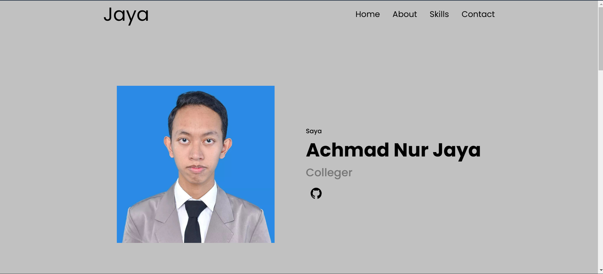

# Portfolio Website - Achmad Nur Jaya

## Preview


Selamat datang di repository **Portfolio Website** saya! 🎉  
Website ini adalah personal portfolio untuk menampilkan informasi tentang saya, keahlian, serta cara menghubungi saya.  

## 🚀 Teknologi yang Digunakan
- **HTML5**: Struktur utama halaman web.
- **CSS3**: Styling dan desain antarmuka.
- **GitHub Pages**: Untuk deployment dan hosting website.
- **GitHub Actions**: Untuk otomatisasi proses deployment.

## 📂 Struktur Proyek
```plaintext
Portfolio/
├── .github/workflows/    # Konfigurasi GitHub Actions untuk deployment
│   └── deploy.yml
├── Asset/                # Folder untuk menyimpan aset seperti gambar
├── style.css             # File CSS untuk styling halaman
├── index.html            # File HTML utama
└── README.md             # Dokumentasi proyek

🛠️ Fitur
Navigasi Halaman: Menu navigasi untuk berpindah antar bagian seperti Home, About, Skills, dan Contact.
Responsive Design: Tampilan yang dapat menyesuaikan pada berbagai perangkat.
Skill Showcase: Daftar keterampilan dengan ikon interaktif.
Link Sosial Media: Tombol untuk mengarahkan ke profil GitHub dan WhatsApp.

⚙️ Cara Menjalankan
Clone Repository:
bash
Copy code
git clone https://github.com/<your-github-username>/Portfolio.git
Buka di Browser: Buka file index.html di browser favorit Anda.

📦 Deployment
Proses deployment otomatis dilakukan menggunakan GitHub Actions setiap kali perubahan didorong ke cabang main.

Cara Kerja Deployment
File deploy.yml pada folder .github/workflows mengatur pipeline untuk:
Mengambil kode dari repository.
Mengunggah file ke GitHub Pages.

✨ Cara Berkontribusi
Fork Repository.
Buat Branch Baru:
bash
Copy code
git checkout -b feature/nama-fitur
Kirim Pull Request.
📧 Kontak
Nama: Achmad Nur Jaya
GitHub: uj4yy
WhatsApp: +6289638244089
